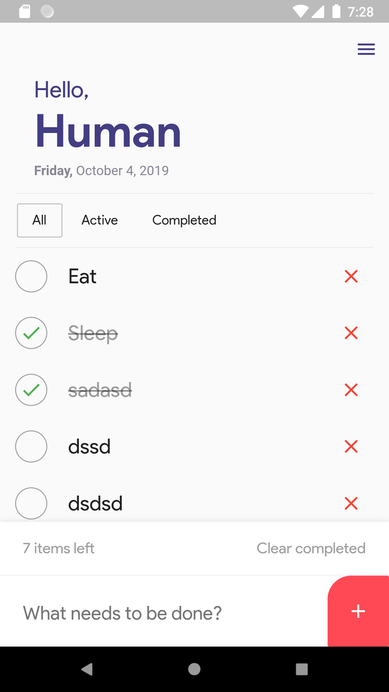

# Todo App UI

A sample UI for todo app developed in flutter

## Task
- Add new todo
- Delete todo
- Check & uncheck todo
- Delete all completed todo
- Display correct active todo still left 
- Filter (All, Active, Completed)

## Demo

  

# Todo-App-Flutter
